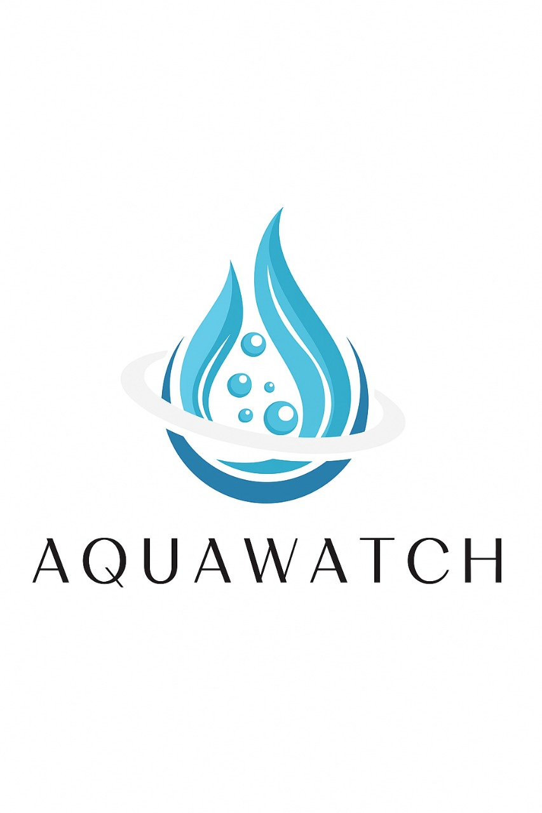
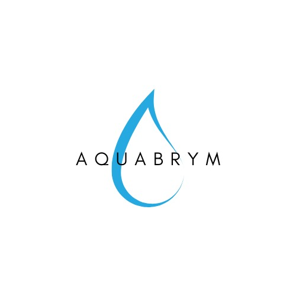
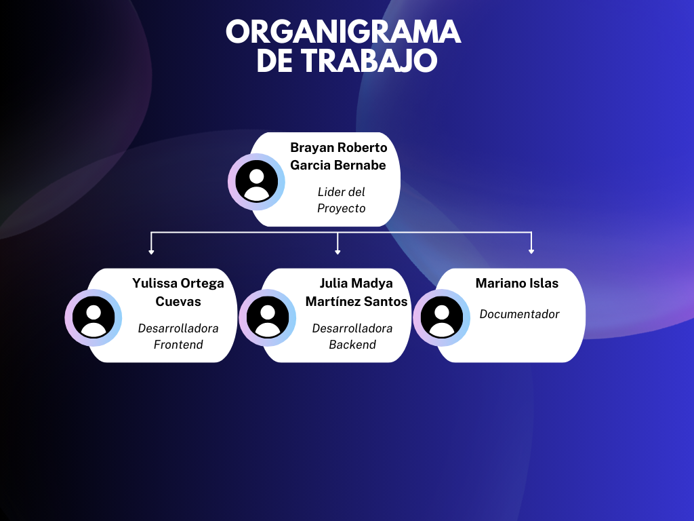
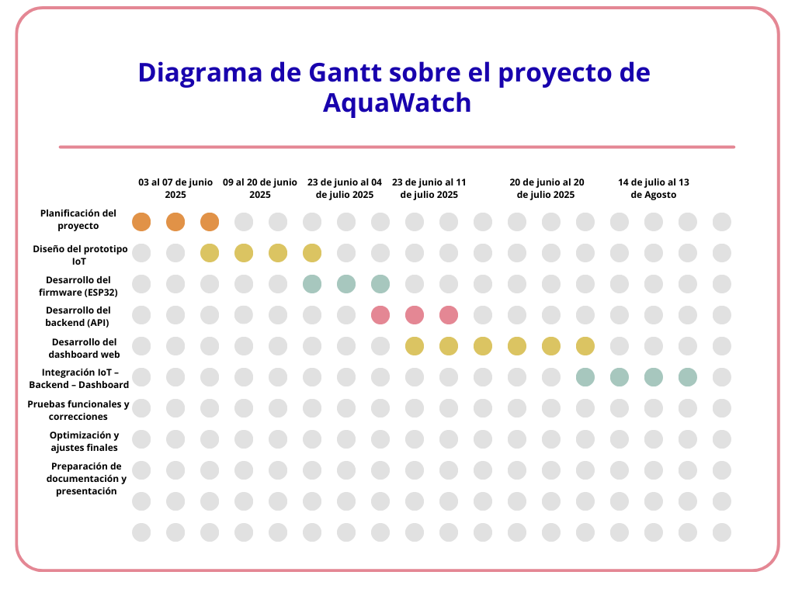

# AQUAWATCH

## Introducción
AquaWatch es una propuesta tecnológica innovadora diseñada para enfrentar el creciente desafío del uso ineficiente del agua, un recurso vital cuya disponibilidad se ve cada vez más comprometida por el cambio climático, el crecimiento poblacional y las malas prácticas de consumo. En muchas comunidades, especialmente en regiones como Xicotepec de Juárez, Puebla, la falta de sistemas de monitoreo accesibles impide que los ciudadanos tengan un control real sobre su consumo, lo que genera desperdicio y encarece el servicio.
Este proyecto combina un dispositivo IoT (Internet de las Cosas) capaz de medir en tiempo real el flujo de agua con una plataforma web interactiva que presenta la información de forma clara, gráfica y fácil de interpretar. Gracias a su diseño intuitivo, AquaWatch permite a cualquier usuario —sin necesidad de conocimientos técnicos— visualizar su consumo, recibir alertas ante patrones anormales y obtener recomendaciones para optimizar el uso del recurso.
A diferencia de otros sistemas del mercado, AquaWatch destaca por su bajo costo, facilidad de instalación y enfoque educativo, fomentando una cultura de ahorro y uso responsable del agua. Con ello, busca no solo ofrecer una herramienta tecnológica, sino también impulsar un cambio de hábitos a largo plazo, contribuyendo al cuidado del medio ambiente y al cumplimiento de los Objetivos de Desarrollo Sostenible (ODS), particularmente el ODS 6: Agua limpia y saneamiento.

 

## Identificación Gráfica
|Logo del Producto  | Logo de la Marca|
|---|---|
|||

 

## Descripción
AquaWatch es un sistema integral de monitoreo hídrico diseñado para brindar a los usuarios control total sobre su consumo de agua. Está compuesto por dos elementos principales:
Dispositivo IoT: Instalado en la red de agua, mide el flujo de forma continua y envía la información mediante conexión inalámbrica a la nube.
Dashboard web: Plataforma en línea que muestra de manera visual los datos recolectados, genera alertas ante consumos elevados y ofrece recomendaciones personalizadas para optimizar el uso del recurso.
Este sistema está pensado para ser accesible y adaptable, lo que permite su implementación tanto en hogares como en escuelas e innovar implementandolo en empresas e instituciones públicas. Su arquitectura tecnológica combina la medición en tiempo real con un análisis de patrones históricos, lo que facilita la detección de fugas, el control de gastos y la prevención del desperdicio.
Con un enfoque en la simplicidad y la educación, AquaWatch busca que cualquier persona, sin conocimientos técnicos, pueda interpretar sus datos y tomar decisiones conscientes que se traduzcan en ahorro económico y cuidado ambiental.

 

## Planteamiento del problema
En Xicotepec de Juárez, Puebla, y en muchas otras regiones de México, el acceso y la gestión eficiente del agua se han convertido en retos críticos. Las fugas no detectadas, la infraestructura envejecida, la sobreexplotación de fuentes y la falta de información para los usuarios generan un desperdicio significativo del recurso. Según datos del INEGI, el consumo promedio por persona en México oscila entre 250 y 300 litros diarios, muy por encima del mínimo recomendado por la OMS (100 litros).
La situación se agrava durante las temporadas secas, cuando la demanda supera la capacidad de captación y distribución, afectando tanto a comunidades rurales como urbanas. La mayoría de las soluciones tecnológicas para el monitoreo hídrico disponibles actualmente son costosas, requieren conocimientos técnicos avanzados o están orientadas a entornos industriales, lo que las hace poco accesibles para el ciudadano común.
Ante esta realidad, existe una necesidad urgente de implementar herramientas tecnológicas económicas, fáciles de usar y enfocadas en la educación y concientización de la población para lograr un cambio real en el consumo.

 

## Propuesta de solución
AquaWatch surge como una respuesta tecnológica accesible y funcional al problema del desperdicio de agua. Su propuesta se basa en un sistema compuesto por un dispositivo IoT y una plataforma web interactiva que trabajan de forma conjunta para registrar, analizar y presentar datos de consumo hídrico en tiempo real.
El dispositivo IoT, instalado en la tubería principal de entrada de agua, emplea sensores de flujo para obtener mediciones precisas que son enviadas automáticamente a la nube. La plataforma web, diseñada con una interfaz intuitiva y atractiva, procesa estos datos y los muestra en gráficos claros que permiten al usuario identificar su consumo diario, semanal y mensual.
Además, AquaWatch incorpora un sistema de alertas inteligentes que notifican cuando se detectan consumos anormales o excesivos, lo que ayuda a detectar fugas o malos hábitos de uso. Estas alertas se complementan con recomendaciones personalizadas, generadas a partir del patrón de uso del usuario, para promover prácticas más eficientes y sostenibles.
Una de las principales fortalezas del proyecto es su enfoque educativo: la información presentada está acompañada de consejos prácticos que explican cómo cada acción de ahorro impacta en el consumo total y en el medio ambiente. Esto lo convierte en una herramienta útil en los hogares e instituciones, fomentando la conciencia ambiental.
A diferencia de las soluciones comerciales más complejas o costosas, AquaWatch prioriza la simplicidad de instalación, el bajo costo y la accesibilidad, asegurando que cualquier persona pueda implementarlo y beneficiarse de sus ventajas. Con ello, se busca no solo reducir el gasto de agua y los costos asociados, sino también contribuir de forma activa al cumplimiento del ODS 6 y a la preservación de este recurso vital para las futuras generaciones.

 

## Objetivo General
Diseñar e implementar una solución tecnológica compuesta por un dispositivo IoT y una plataforma web interactiva que permita a hogares e instituciones del municipio de Xicotepec de Juárez, Puebla, monitorear su consumo de agua en tiempo real. El sistema debe fomentar hábitos de uso responsable, identificar patrones de consumo ineficiente, detectar fugas y promover la sostenibilidad del recurso hídrico mediante alertas automáticas y recomendaciones personalizadas. Con ello, se busca reducir el desperdicio de agua, generar ahorros económicos y contribuir al cuidado del medio ambiente.
 

## Objetivos Específicos
1. Desarrollar un prototipo funcional de dispositivo para registrar el consumo de agua en tiempo real. 

2. Crear un dashboard web que visualice los datos recolectados de manera clara e intuitiva. 

3. Implementar alertas de consumo elevado y recomendaciones personalizadas. 

4. Analizar patrones de uso del agua y proponer estrategias de optimización. 

5. Validar el sistema en un entorno real o simulado para medir su impacto y funcionalidad. 

 

## Organigrama de Trabajo
Este organigrama representa la estructura organizativa del equipo, mostrando de manera visual los roles.
Su objetivo principal es definir claramente las responsabilidades de cada miembro, asegurando una distribución eficiente de tareas y fomentando una mejor comunicación y coordinación.

  

 

## Tabla de Colaboradores
### Colaboradores
---

<table align="center">
  <tr>
    <th>Integrantes</th>
    <th>Contacto</th>
    <th>Rol</th>
  </tr>
  <tr>
    <td>Brayan Roberto García Bernabe</td>
    <td>📧 BraytoGBDX@gmail.com</td>
    <td>Lider del proyecto</td>
  </tr>
    <tr>
    <td>Julia Maday Martínez Santos</td>
    <td>📧 julisantos@gmail.com</td>
    <td>Desarrolladora de Backend</td>
  </tr>
  <tr>
    <td>Mariano Fajardo Islas</td>
    <td>📧 marianoislasfajardo@gmail.com</td>
    <td>Documentador</td>
  </tr>
  <tr>
    <td>Yulissa Ortega Cuevas</td>
    <td>📧 YuliOrtega22@gmail.com</td>
    <td>Diseñadora de Fronted UI/UX</td>
  </tr>
</table>

 

## Diagrama de Gant

  

 

## Lista de Técnologías
#### 🧰 Tecnologías utilizadas en el Backend 

| Tecnología       | Descripción                                     |
|------------------|-------------------------------------------------|
| 🧱 NestJS         | Framework progresivo de Node.js para backend    |
| 📦 TypeORM        | ORM para interactuar con la base de datos       |
| 🐬 MySQL          | Base de datos relacional utilizada              |
| 📄 Swagger        | Generación automática de documentación API      |

#### 🧰 Tecnologías utilizadas en el Frontend

| Tecnología     | Descripción                                       |
|----------------|---------------------------------------------------|
| ⚛️ React        | Librería para construir interfaces de usuario     |
| ⚡ Vite         | Entorno de desarrollo rápido                      |
| 📦 pnpm         | Gestor de paquetes rápido y eficiente             |
| 📈 Charts       | Para visualización de consumo (gráficas)          |
| 🧠 Arduino      | Hardware que captura los datos del consumo        |

 
